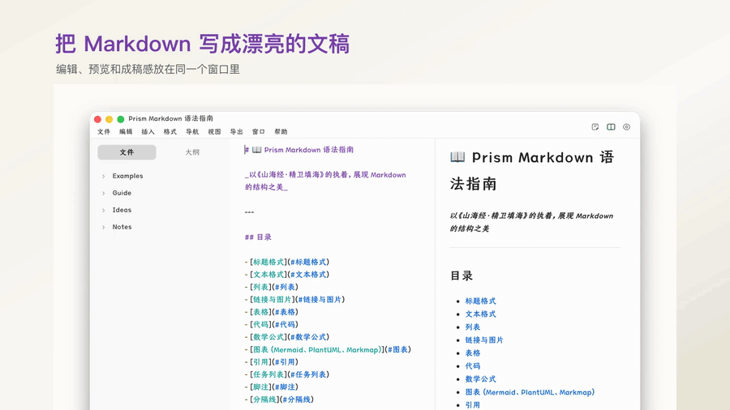
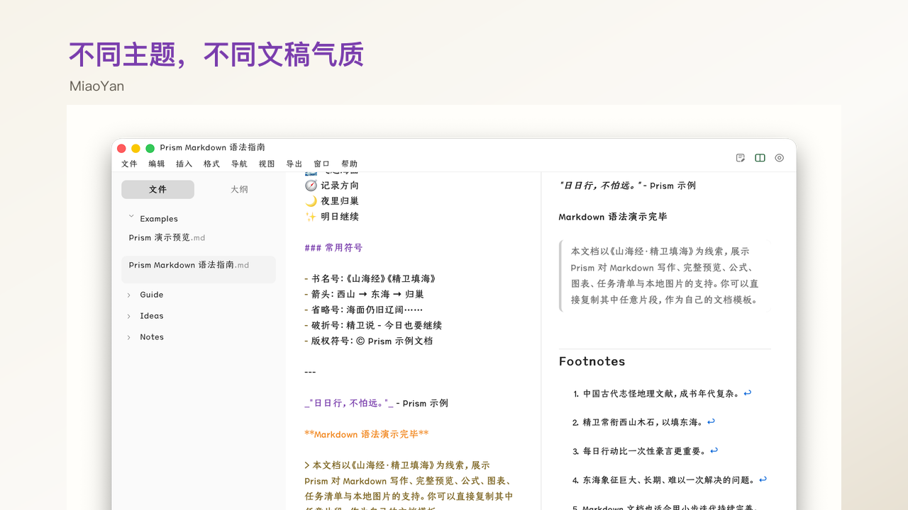
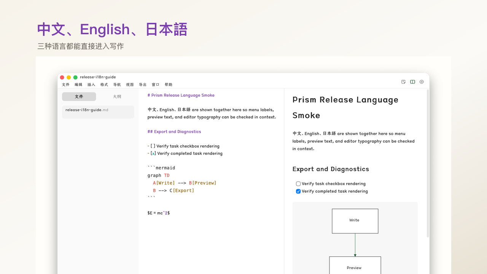
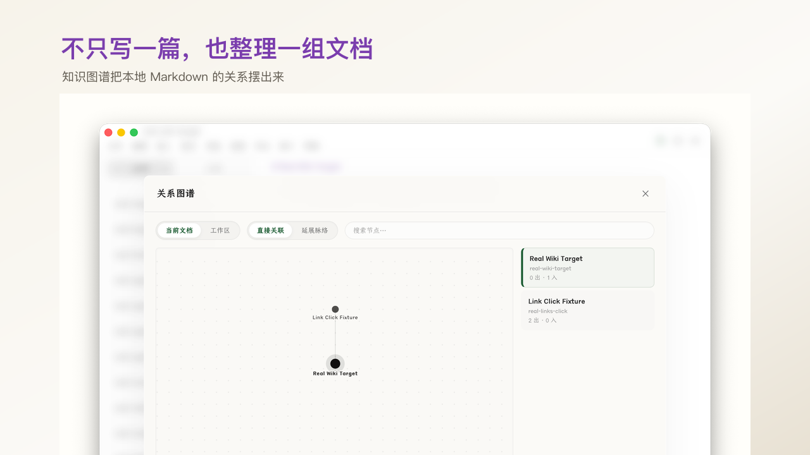
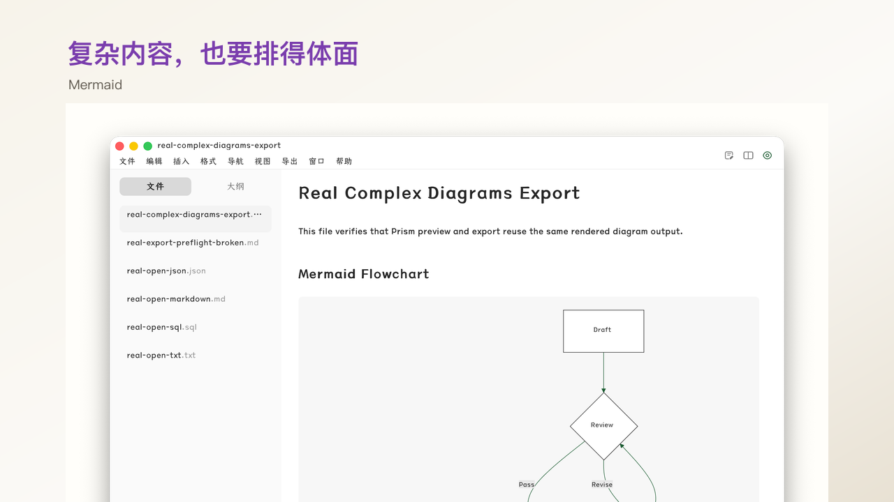
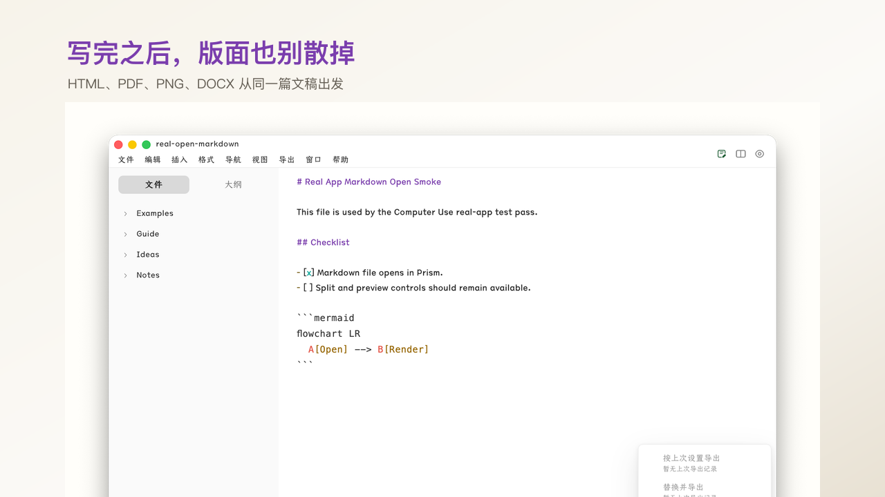
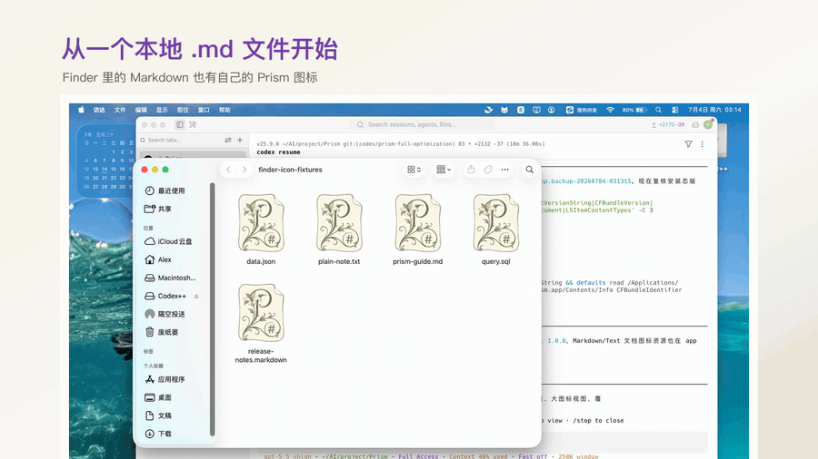

<div align="center">

# Prism

**把 Markdown 写成漂亮的文稿。**

Prism 是一款开源免费的本地 Markdown 编辑器。它让文档在编辑、预览和导出时都保持更完整的版面感，也把主题、三语界面、知识图谱和导出诊断放进同一个桌面写作体验里。

<p>
  <a href="README.md">English</a>
  ·
  <a href="README.zh-CN.md">简体中文</a>
  ·
  <a href="README.ja-JP.md">日本語</a>
</p>

<p>
  <a href="https://github.com/AlexPlum405/Prism/releases/tag/v1.0.0">
    
  </a>
  <a href="https://github.com/AlexPlum405/Prism/releases/latest">
    
  </a>
  
  
</p>



<sub>
  Prism 1.0.0 for macOS Apple Silicon ·
  <a href="https://github.com/AlexPlum405/Prism/releases/download/v1.0.0/Prism_1.0.0_aarch64.dmg">下载 DMG</a>
  · SHA256:
  <code>ef995e02a2a8aa1a4319d7929688c9c4f59125af6b7cc13fd8601a3f99919993</code>
</sub>

</div>

---

## 为什么做 Prism

Markdown 很容易写，但成品常常还停留在草稿感里。Prism 关心的是写完之后的那一段：版面、预览、文件之间的关系，以及文档离开编辑器时还能不能保持体面。

Prism 1.0.0 重点展示五件事：

- **文稿感写作**：编辑、分屏、预览围绕笔记、长文和技术文档设计。
- **真正有差异的主题**：MiaoYan、Inkstone、Slate、Mono、Nocturne Dark 会同时影响字体、表格、代码、引用和预览。
- **知识结构**：链接、反链和知识图谱让本地 Markdown 不只是孤立文件。
- **三语界面**：中文、English、日本語 都是产品体验的一部分。
- **导出不散版**：HTML、PDF、PNG、DOCX 导出配合缺图、坏链和渲染风险诊断。

## 看看 Prism

| 主题 | 三语界面 |
| --- | --- |
| <a href="docs/releases/prism-macos-1.0.0-confidence-pack/promo-page/assets/prism-themes.mp4"></a> | <a href="docs/releases/prism-macos-1.0.0-confidence-pack/promo-page/assets/prism-languages.mp4"></a> |

| 知识图谱 | 图表与公式 |
| --- | --- |
| <a href="docs/releases/prism-macos-1.0.0-confidence-pack/promo-page/assets/prism-knowledge-graph.mp4"></a> | <a href="docs/releases/prism-macos-1.0.0-confidence-pack/promo-page/assets/prism-diagrams-formulas.mp4"></a> |

| 导出 | 本地文件 |
| --- | --- |
| <a href="docs/releases/prism-macos-1.0.0-confidence-pack/promo-page/assets/prism-export.mp4"></a> |  |

## 下载

| 平台 | 状态 | 下载 |
| --- | --- | --- |
| macOS Apple Silicon | 已发布 | [Prism_1.0.0_aarch64.dmg](https://github.com/AlexPlum405/Prism/releases/download/v1.0.0/Prism_1.0.0_aarch64.dmg) |
| Windows | 待发布 | 真机验证后发布 |
| Linux | 待发布 | 真机验证后发布 |

Prism 1.0.0 是第一个公开正式版本，当前首发 macOS Apple Silicon。Windows 和 Linux 会在真机验证完成后再发布。

## 功能

### 写作

- 本地 Markdown 和文本文件编辑
- 编辑、分屏、预览三种模式
- 自动保存和未保存状态追踪
- 搜索、替换、选区和键盘操作
- 文件树、大纲、上下文菜单和状态栏

### 预览

- GitHub Flavored Markdown
- 代码高亮
- 表格、任务列表、引用、链接、标记和分隔线
- KaTeX 数学公式
- Mermaid 图表
- PlantUML 图表
- Markmap 思维导图

### 知识结构

- Wiki 链接
- 当前链接和反链
- 文档属性
- 本地 Markdown 工作区关系图谱

### 导出

- HTML
- PDF
- PNG
- Word `.docx`
- 缺图、坏链、渲染失败和导出风险诊断

## 主题

Prism 的主题不是简单换色。每个主题都会定义自己的字体、背景、代码块、表格、引用和预览关系。

- **MiaoYan**：适合长文写作和成稿预览
- **Inkstone**：更接近纸面编辑的气质
- **Slate**：适合结构清楚的技术文档
- **Mono**：适合黑白草稿和实验笔记
- **Nocturne Dark**：真正的深色写作界面

## 已知限制

- 1.0.0 不包含自动更新分发，因为本次发布没有可用的 updater signing private key。
- Windows 和 Linux 还不是 1.0.0 正式发布平台。
- 全断网渲染验证、HiDPI 矩阵和长时间内存压力测试属于 1.0 之后的硬化工作。

## 技术栈

| 层级 | 技术 |
| --- | --- |
| 桌面外壳 | Tauri 2 |
| 前端 | React 18 + TypeScript |
| 编辑器 | CodeMirror 6 |
| 状态管理 | Zustand |
| 构建工具 | Vite |
| Markdown 管线 | unified、remark、rehype |
| 数学公式 | KaTeX |
| 图表 | Mermaid、PlantUML、Markmap |
| 导出 | docx、pdf-lib、html2canvas |
| 测试 | Vitest + Testing Library |

## 本地开发

### 环境要求

- Node.js 18+
- Rust 1.77+
- 当前平台对应的 Tauri 2 环境依赖

### 启动开发环境

```bash
git clone https://github.com/AlexPlum405/Prism.git
cd Prism
npm install
npm run tauri:dev
```

### 构建

```bash
npm run build
npm run tauri:build
```

构建产物位于：

```text
src-tauri/target/release/bundle/
```

### 测试

```bash
npm test
npm run build
```

## 贡献

欢迎提交 issue 和 pull request。如果你反馈的是视觉问题，请尽量附上：

- 系统和应用版本
- 当前视图模式：编辑、分屏或预览
- 当前主题
- 截图或最小 Markdown 示例

## 许可证

[MIT](LICENSE)
