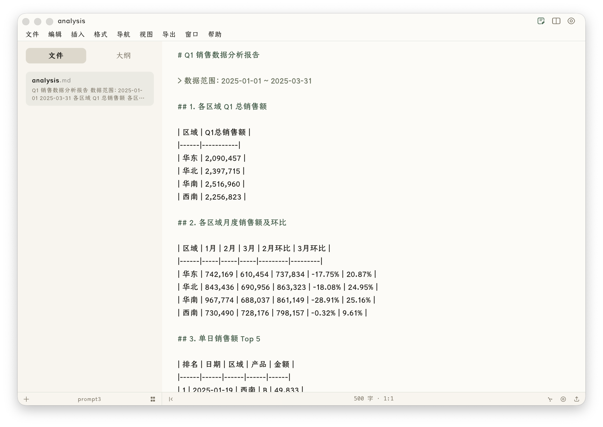
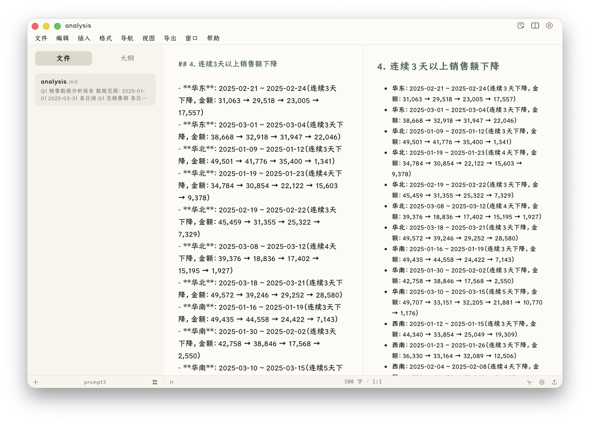
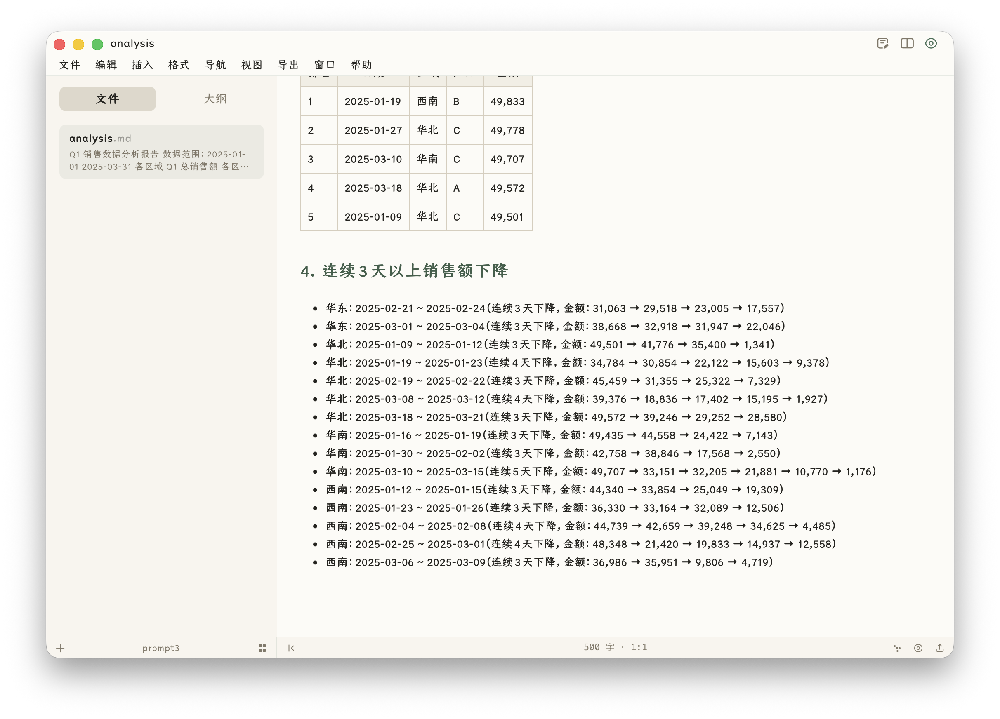
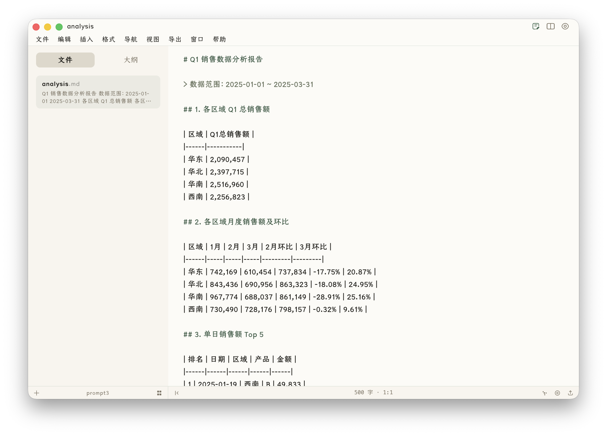
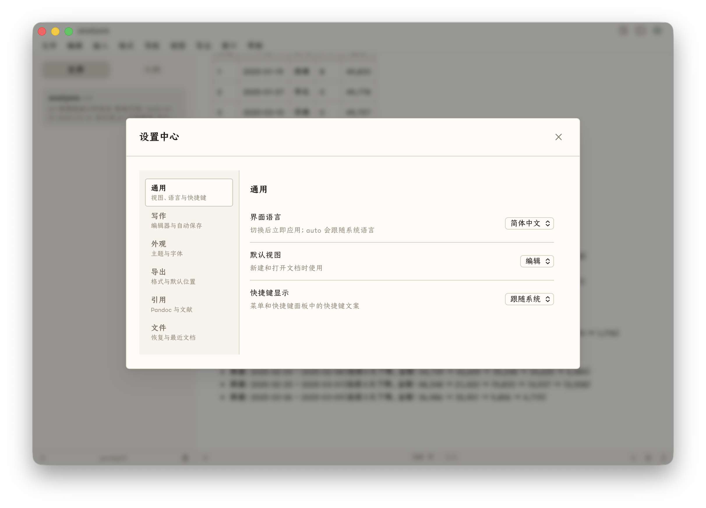

# Prism 当前 UX 审计报告

> 日期：2026-05-29
> 范围：仅基于当前代码实现与本次原生运行态截图，不引用旧 UX 报告结论。
> 运行对象：`src-tauri/target/release/bundle/macos/Prism.app`。
> 当前样本：打开工作区 `/Users/Alex/hermes-test/spark/prompt3` 与文档 `analysis.md`。

## 结论

当前 Prism 的 UX 大方向是合理的，已经形成了一个清晰的妙言式 macOS Markdown 写作器：轻导航、低噪声编辑区、源码/分栏/预览三态、底部状态栏和设置中心都服务“单文档写作”这个主任务。

但当前还不是成熟状态。主要问题不在视觉审美，而在功能入口与交互体系：命令面板还不是完整命令面板，分栏模式下编辑表格/数字文档的体验明显吃力，macOS 下存在系统菜单与窗口内菜单的重复感，若干控件语义和键盘可达性不足。综合判断：当前可作为写作器主界面继续迭代，UX 成熟度约 76/100。

## 审计依据

### 当前运行截图

编辑模式：

分栏模式：

预览模式：

快速打开：

设置中心：

### 当前代码依据

- 产品语境：`CONTEXT.md` 明确 Prism 是 Typora 式单文档单窗口写作器，当前主视觉是妙言风格。
- 外壳结构：`src/App.tsx`、`src/app/controllers/WorkspaceController.tsx`、`src/components/shell/TitleBar.tsx`、`src/components/shell/MenuBar.tsx`。
- 主编辑链路：`src/domains/document/components/DocumentView.tsx`、`src/domains/editor/components/SplitView.tsx`、`src/domains/editor/components/EditorPane.tsx`、`src/domains/editor/components/PreviewPane.tsx`。
- 工作区与状态栏：`src/domains/workspace/components/Sidebar.tsx`、`src/domains/workspace/components/FileTree.tsx`、`src/domains/workspace/components/StatusBar.tsx`。
- 浮层入口：`src/components/shell/CommandPalette.tsx`、`src/components/shell/SettingsModal.tsx`。
- 视觉实现：`src/styles/miaoyan.css`、`src/styles/editor.css`、`src/styles/preview.css`、`src/styles/floating.css`。

## 当前体验结构

Prism 当前界面由五层组成：

1. 顶部标题栏：显示当前文档名与视图模式切换。
2. 顶部菜单栏：文件、编辑、插入、格式、导航、视图、导出、窗口、帮助。
3. 左侧边栏：文件/大纲两态，文件项带标题与内容摘要。
4. 中央写作区：编辑、分栏、预览三态互斥。
5. 底部状态栏：新建、工作区、列表/树、收起侧边栏、字数行列、关系图谱、专注、导出。

这个结构与“单文档写作器增强型”匹配，避免了标签页、知识库面板和多栏信息墙。视觉上也基本符合妙言风格：白底、低对比边线、轻侧栏、紧凑标题栏、偏中文长文的排版气质。

## 做得好的部分

### 1. 主界面没有偏离写作器定位

当前 app 不是 IDE、Notion 或 Obsidian 式工作台。文件树只是导航入口，中间区域始终让位给当前文档。这与 `CONTEXT.md` 中的单文档单窗口定位一致。

### 2. 妙言风格已经落到细节

`src/styles/miaoyan.css` 里定义了 280px 侧栏、`#fafafa` 侧栏底、低对比 hairline、中文字体、绿色弱强调色。截图中这些令牌实际生效，整体比早期通用网页式编辑器更接近 macOS 写作工具。

### 3. 三种视图模式路径清楚

编辑、分栏、预览三态在标题栏右上角常驻，且 `SplitView` 中的源码和预览是同一文档状态的两个视图。分栏切换后滚动位置能基本保持上下文，说明主链路可用。

### 4. 快速打开和设置中心克制

快速打开尺寸、层级、键盘焦点都比较合理，适合文件定位。设置中心左侧分类、右侧行式设置也比较稳，视觉密度没有失控。

### 5. 状态栏方向正确

当前状态栏只占 26px 左右，没有把底部做成信息仪表盘。字数与行列居中，导出和专注放右侧，符合低干扰写作器。

## 主要问题

### P1：命令面板名义和能力不一致

当前 `CommandPalette` 只有 `files` 和 `search` 两种模式，实际是“快速打开/全文搜索”，不是完整命令面板。代码中 `CommandPaletteMode = 'files' | 'search'`，列表来源也只来自文件排序与工作区搜索。

这会影响很多已规划功能的发现路径。`CONTEXT.md` 里把“打开文档属性”“查看当前文档链接”“查看反向链接”等能力放进命令面板，但当前用户无法像 Raycast/VS Code 那样输入动作名来执行命令，只能去菜单里找。

建议：把现有 command registry 接入同一个 palette，形成统一搜索结果：命令、文件、标题、全文。默认输入先搜命令和文件，`>` 或空格前缀可强化命令搜索。

### P1：分栏模式下表格/数字文档编辑体验弱

分栏模式采用近似 50/50 布局。对于普通散文很舒服，但当前样本文档是表格和数字分析，源码侧的 Markdown 表格在半宽空间内明显难读，长列表也频繁折行。妙言字体对中文正文友好，但对 Markdown 表格、数字列和竖线对齐不够友好。

建议：

- 在分栏模式中提供“编辑区更宽/预览区更宽/均分”三档布局。
- 表格行、代码块、Front Matter 等结构化区域优先使用等宽字体或关闭软换行。
- 状态栏或视图菜单里给 `wordWrap` 一个更近的入口，至少在表格密集文档里容易关闭。

### P1：普通浏览器 Vite 运行态白屏，影响设计验证

本次打开 `http://127.0.0.1:5173/` 时页面白屏。控制台错误来自 `TitleBar.tsx` 中 `useState(() => getCurrentWindow())`，普通浏览器环境没有 Tauri window metadata。

这不是原生用户态问题，但会严重影响 UX 迭代效率：设计评审、Playwright 截图、组件调试都会被迫绕到原生 app。

建议：给 Tauri window API 做 adapter，在非 Tauri 环境返回 no-op window；或者让 `TitleBar` 只在需要执行最小化/关闭时懒调用。至少保证 Vite 页面可以渲染主 UI。

### P2：macOS 下菜单有重复感

原生 macOS 顶部系统菜单已经存在 `Prism / File / Edit / View / Window / Help`，窗口内又有一行中文菜单 `文件 / 编辑 / 插入 / 格式 / 导航 / 视图 / 导出 / 窗口 / 帮助`。如果这是跨平台一致性选择，可以保留；但在 macOS 写作器语境里，它会削弱原生感，并占用一行垂直空间。

建议做明确取舍：

- macOS 优先原生菜单：窗口内菜单隐藏或只保留轻量工具入口。
- 跨平台统一菜单：系统菜单只保留最小壳，窗口内菜单承担完整功能，并把视觉处理得更像 app toolbar。

当前两者同时存在，产品信号不够干净。

### P2：标题栏视图切换和状态栏图标可发现性偏弱

视图切换按钮尺寸为 23x23，状态栏图标约 20x19，活跃态主要靠颜色变化。对于熟练用户够用，但新用户第一次很难知道右上三个图标分别代表什么，底部关系图谱/专注/导出也依赖 hover tooltip。

建议：

- 视图切换改成更明确的 segmented icon group，保留图标但增加选中底板。
- 状态栏右侧只保留高频和状态相关图标；低频入口更多放进命令面板。
- 首次使用或空文档状态可短暂显示文本标签，进入稳定使用后收起。

### P2：状态栏有轻微功能收纳倾向

`CONTEXT.md` 写明状态栏不是功能入口收纳区，文档信息类能力第一版先进入命令面板。当前状态栏右侧直接显示关系图谱入口，只要文档有保存路径就常驻。这会把 Prism 的产品信号从“写作器”轻微推向“知识图谱工具”。

建议：关系图谱先回到命令面板或导航菜单；如果要保留状态栏入口，至少只在工作区索引中确实存在链接关系时显示，或作为用户可配置项。

### P2：键盘与可访问性语义不足

当前 `MenuBar` 的菜单项是 `div` 加 `onClick`，`FileTree` 的文件项也是 `div` 加 `onClick`。这对视觉体验影响不大，但会影响键盘导航、屏幕阅读器语义和自动化测试稳定性。

建议：

- 菜单根项使用 `button` 或补齐 `role="menuitem"`、`tabIndex`、方向键逻辑。
- 文件树使用 tree/treeitem 语义，至少支持 Enter 打开、左右展开折叠、F2 重命名。
- 快速打开的列表项补 `role="option"` 与 `aria-selected`。

### P3：样式实现还比较补丁化

当前视觉结果可用，但样式层存在较多 inline style、`!important` 覆盖和历史令牌注释。`src/styles/tokens.css` 里还保留“OpenAI 风格设计令牌系统”的注释，虽然运行时妙言覆盖已经生效，但维护者阅读时容易误判当前设计基准。

建议：不急着大重构，但后续每做一个 UI 区域，就顺手把该区域的 inline style 收敛到 module CSS 或主题令牌，减少后续视觉漂移。

## 分维度评分

| 维度 | 评分 | 判断 |
|---|---:|---|
| 产品定位匹配 | 8/10 | 单文档写作器方向明确，没有变成复杂工作台 |
| 视觉一致性 | 8/10 | 妙言风格基本成立，侧栏、预览、设置中心都克制 |
| 写作效率 | 7/10 | 普通长文不错，表格/数字/结构化 Markdown 仍弱 |
| 功能发现性 | 6/10 | 菜单完整，但命令面板不完整，图标入口隐晦 |
| 原生桌面感 | 7/10 | macOS 外观较好，但窗口内菜单与系统菜单关系需明确 |
| 可访问性 | 5/10 | 多处交互元素语义不足，键盘路径还不够完整 |
| 可维护性 | 6/10 | 视觉结果好于样式结构，后续容易漂移 |

## 建议迭代顺序

### 第一优先级

1. 把快速打开升级为真正命令面板：接入 command registry，支持命令、文件、标题、全文混合搜索。
2. 修复 Vite 浏览器白屏：为 Tauri window API 做非 Tauri fallback，保证设计验证和 Playwright 截图可运行。
3. 优化分栏编辑表格体验：布局比例、等宽结构区、word wrap 快捷入口。

### 第二优先级

1. 明确 macOS 菜单策略：原生菜单优先，还是窗口内菜单优先。
2. 强化视图切换活跃态和状态栏图标的可发现性。
3. 关系图谱入口降权：回到命令面板/导航菜单，或按链接上下文条件显示。
4. 补齐菜单、文件树、palette 列表的键盘和 ARIA 语义。

### 第三优先级

1. 收敛 inline style 和 `!important` 覆盖。
2. 更新历史注释，让设计令牌说明和当前妙言方向一致。
3. 为关键 UI 状态建立截图基准：编辑、分栏、预览、快速打开、设置中心、导出失败、诊断面板。

## 最终判断

Prism 当前 UX 是“方向正确、基础可用、细节未完全收口”。它已经不像通用 Web 编辑器，而更像一个有明确审美和工作流边界的桌面 Markdown 写作器。下一阶段不要重做视觉方向，应该优先补齐命令入口、结构化 Markdown 编辑体验、macOS 菜单策略和可访问性语义。
