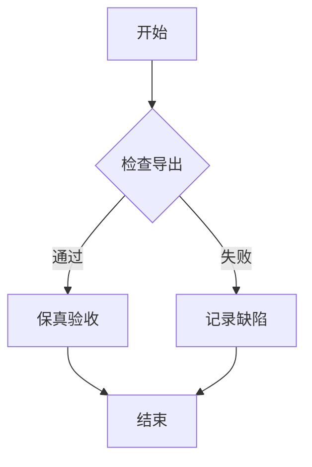
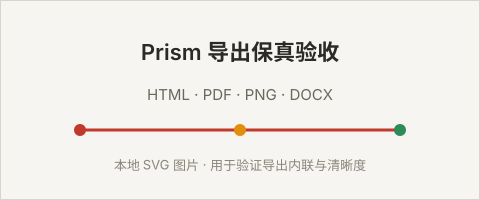

# 导出保真验收样本

本文用于人工核对 HTML / PDF / PNG / DOCX 四种格式的导出保真度。导出后请对照下方每一节，确认渲染块不被分页切断、图片清晰、非纯文本内容尽量接近预览。

## 1. 中文长文与行内标记

这是一段中文长文内容，混排 English words 与行内 `code`，包含**加粗**、*斜体*、~~删除线~~ 与 ==高亮标记==。导出应稳定保留中文排版、标点与各类行内标记，不出现乱码或标记泄漏。

行内公式示例：质能方程 $E = mc^2$，以及下标 $a_{i} + b_{j} = c_{k}$。

## 2. 宽表格

| 模块 | 状态 | 负责人 | 备注说明（较长列，用于验证宽表格不被截断或挤压变形） |
| --- | --- | --- | --- |
| 编辑器 | 通过 | Alex | CodeMirror 6，源码可见可编辑 |
| 预览 | 通过 | QA | remark + rehype 渲染管道 |
| 导出 | 验证中 | QA | HTML / PDF / PNG / DOCX 四格式保真 |
| 表格 | 通过 | QA | 保留表头、对齐与单元格内容 |

## 3. 代码块与嵌套

普通带语言标注代码块：

```ts
interface ExportInput {
  content: string;
  format: 'html' | 'pdf' | 'png' | 'docx';
}

function describe(input: ExportInput): string {
  return `导出 ${input.format}，长度 ${input.content.length}`;
}
```

无语言标注（应触发自动高亮）：

```
const answer = "42";
console.log(answer);
```

代码块内含 Markdown 标记字符（应原样保留，不被解析）：

```md
# 这是代码块里的标题
> [!NOTE] 这不是真的 Callout
- [ ] 这不是真的任务项
```

## 4. 块级公式

$$
\int_{0}^{\infty} e^{-x^2} \, dx = \frac{\sqrt{\pi}}{2}
$$

$$
\begin{aligned}
f(x) &= a x^2 + b x + c \\
f'(x) &= 2 a x + b
\end{aligned}
$$

## 5. Mermaid 图表



## 6. 本地图片

下面引用一张相对路径的本地图片，导出时应内联或正确解析路径，不应丢失或降清：



## 7. Callout

> [!NOTE]
> 这是一条 NOTE 提示，导出后应保留为轻量提示块，不泄漏方括号叹号源码标记。

> [!WARNING]
> 这是一条 WARNING 提示，用于验证不同类型 Callout 的样式区分。

> [!TIP]
> 这是一条 TIP 建议。

> [!IMPORTANT]
> 这是一条 IMPORTANT 重要内容。

## 8. Toggle 折叠块

<details>
<summary>点击展开折叠内容</summary>

折叠区域内包含 **加粗**、`代码` 和一个小列表：

- 第一项
- 第二项

PDF / PNG 导出应为展开态；DOCX 应降级为「标题 + 展开正文」。

</details>

## 9. 长文分页压力

下面是较多段落，用于验证 PDF / PNG 分页时图片与渲染块不被页边界切断，且不自动降清晰度。

第一段：导出保真的核心是非纯文本内容（Mermaid、KaTeX、SVG、本地图片、Callout、Toggle）尽量接近预览。

第二段：PDF 分页应在原子块前插入间隔，避免一张图被切成两半。

第三段：PNG 默认高清，不因尺寸过大而自动降清，超限时应明确报错而非静默降级。

第四段：DOCX 对复杂非文字内容可图片化嵌入，优先保证视觉结果接近预览。

第五段：导出失败必须给出可理解诊断，包含阶段、格式、文件路径与下一步建议。

---

> 验收完成后，请在 `docs/verification/` 记录每种格式的实际结果与遗留缺陷。
