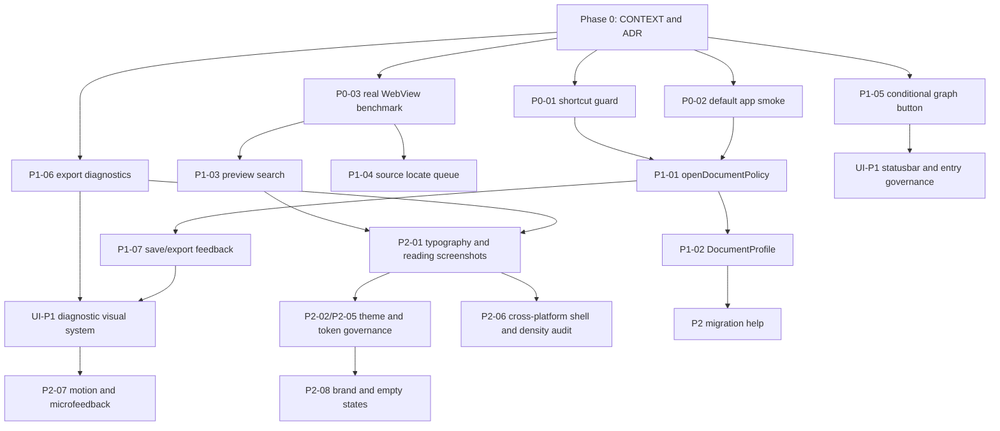

# Prism 可执行优化计划

> 日期：2026-06-17  
> 来源：`docs/reviews/prism-multi-perspective-review-2026-06-16.md`、`CONTEXT.md`、`docs/adr/`、`docs/verification/prism-preview-full-render-performance-2026-06-12.md` 和当前仓库脚本。  
> 目标：把多视角评审收敛成可以分阶段实施、验收和回归的优化路线图。  

## 1. 当前决策基线

本计划以以下已确认决策为约束，不再在每个任务中重复争论：

1. Prism 是 Markdown-first 的单活动文档写作器，不是知识库工作台、Notion 替代品、通用代码 IDE、AI 写作平台或云协作工具。
2. 视觉方向采用 Prism 跨平台写作器气质，详见 ADR-0006。妙言风格继续作为克制、轻量、中文长文排版的参考，但不是唯一验收标准。
3. 每个窗口同一时间只有一个活动文档。系统打开、主菜单打开和新建文档默认新开窗口；工作区文件树、快速打开和最近文件可以在当前窗口切换活动文档，但必须保护未保存内容，并提供“在新窗口打开”入口。
4. 文档类型分为 Markdown Document 与 Text Document，详见 ADR-0007。Text Document 覆盖 `.txt`、`.text`、`.sql`、`.json`、`.jsonc`、`.yaml`、`.yml`、`.toml`、`.xml`、`.csv`、`.tsv`、`.log`、`.ini`、`.conf`、`.env`，但不默认承诺 Markdown 预览、导出保真、页面链接、反链或关系图谱。
5. 状态栏不是功能入口收纳区。关系图谱按钮只在当前 Markdown Document 存在文档链接关系时显示；没有出链或反链则不显示。
6. 导出诊断产品化是 P1，优先级高于纯视觉细节打磨。导出前检查和导出失败反馈必须可理解、可定位、可修复。
7. 完整预览性能优化必须先补真实 Tauri WebView 基准。只有真实基准证明 DOM commit 或后处理仍是瓶颈，才进入分阶段 DOM commit 或渐进 hydrate。

## 2. 排序原则

路线排序按四个维度加权：

| 维度 | 判断方式 |
|---|---|
| 用户价值 | 是否直接减少写作中断、打开失败、导出不可信、长文档卡顿。 |
| 实现成本 | 是否能局部改动、是否已有测试锚点、是否需要 Tauri/Rust/前端跨层联动。 |
| 风险 | 是否影响保存、打开、预览、导出、索引、文件关联等高风险链路。 |
| 跨平台一致性 | 是否能在 macOS / Windows / Linux 上解释一致，平台差异是否只留在系统层。 |
| 视觉与阅读质量 | 是否提升写作界面的安静感、阅读排版、控件密度、品牌识别和微反馈一致性。 |

执行时遵守两个硬门槛：

1. P0/P1 不做“换皮式”视觉优化，必须先守住写作连续性、打开链路、真实性能证据和导出可信。
2. 任何影响文件系统、启动参数、默认 app、保存、导出、预览 DOM 的改动，都必须有测试或 smoke 记录，不只靠人工感觉。

## 3. 路线总览

| Phase | 目标 | 主要输出 | 退出标准 |
|---|---|---|---|
| Phase 0：产品语境冻结 | 防止后续实现继续分叉 | `CONTEXT.md`、ADR-0006、ADR-0007、本计划 | 产品边界、文档类型、视觉方向、图谱入口、导出诊断优先级明确 |
| Phase 1：写作链路 P0 | 输入、默认打开、真实性能证据不再含糊 | 快捷键豁免、默认 app smoke、真实 WebView benchmark | P0 测试或 smoke 通过，长文档指标可重复 |
| Phase 2：高频路径 P1 | 打开、文件类型、搜索、源码定位、诊断反馈统一 | openDocumentPolicy、DocumentProfile、预览搜索、定位队列、导出诊断 | 菜单/文件树/最近/系统打开行为一致，导出错误可定位 |
| Phase 3：视觉/UI 与体验质量 P2 | 让跨平台美学、阅读排版、命令、迁移帮助可回归 | UI 审计、截图基准、token audit、帮助页、命令面板分组、动效规范 | 默认主题、三态视图、控件密度、迁移说明和低频入口有稳定验收 |
| Phase 4：延后和不做 P3 | 防止产品被热点稀释 | Not-now 清单和重评条件 | AI、云、协作、插件、重型图谱、完整 block editor 不进入近期实现 |

## 3.1 视觉/UI 优化轨道

视觉/UI 优化不是“换皮”，也不是等所有工程问题完成后才做。它是一条独立轨道：P0/P1 先避免 UI 入口和反馈破坏写作信任，P2 再系统提升美学、排版和品牌气质。

| 层级 | 优化方向 | 用户影响 | 推荐改法 | 验收标准 |
|---|---|---|---|---|
| UI-P1 | 状态栏与低频入口治理 | 第一屏回到写作器气质，不像功能工具台 | 状态栏只保留统计、`ERROR n`、后台导出、专注/导出和条件图谱按钮；属性、反链、普通文档信息进入命令面板 | 空文档和无关系文档状态栏不显示图谱；有关系 Markdown Document 才显示图谱按钮 |
| UI-P1 | 诊断和错误反馈视觉系统 | 错误可理解但不吓人，导出失败不像半成品 | `ERROR n`、导出失败、Mermaid/KaTeX 错误、缺失资源使用同一套轻量浮层/列表/定位反馈 | 错误包含阶段、对象、原因、下一步；视觉上可定位但不压过正文 |
| UI-P2 | 默认阅读排版调优 | 中文长文阅读更稳，宽屏不发散 | 建截图基准后评估正文列宽、标题层级、段距、列表缩进、代码块、表格、引用、公式、Mermaid、暗色模式 | 1200/1440/1920 宽度下正文行长、表格可读性和暗色对比达标 |
| UI-P2 | 跨平台壳与控件密度收口 | macOS / Windows / Linux 都像 Prism，而不是某个平台移植品 | 固定左侧工作区、中心写作、右上视图模式、底部状态栏密度；平台差异只留给系统 chrome、菜单和文件管理器措辞 | 三平台截图中结构、间距、控件密度一致，平台差异可解释 |
| UI-P2 | Design token 与主题治理 | 后续 UI 不继续混用历史 OpenAI 语义和局部 override | 审计 `tokens.css`、`miaoyan.css`、theme contract，先文档化层级，再逐步收敛变量来源 | 新 UI 不新增 OpenAI-only token；默认主题和内置主题有截图回归 |
| UI-P2 | 微反馈与动效节奏 | 菜单、浮层、搜索、保存、导出状态不显得拼装 | 统一 hover、active、popover、toast、搜索命中和定位源码反馈；尊重 reduced motion | 浮层开合、按钮状态、错误定位和导出状态时长来自 token 或统一常量 |
| UI-P2 | 品牌与空状态 | 用户能记住 Prism，而不只是“像妙言的编辑器” | 梳理 app icon 使用、空文档、About、欢迎/帮助入口和导出页可选品牌露出 | 首屏、空状态、About 能表达本地写作、完整预览、可信导出 |
| UI-P3 | 图标规范 | 新增图标不破坏跨平台一致性 | 建 16/20px grid、线宽、圆角、hover/active 规范；暂不急于替换全部手写 SVG | 新增图标不抖动、不混风格，有截图或视觉 review |

## 4. Phase 0：产品语境冻结

已完成文档层决策，本阶段不要求代码改动。

| ID | Task | 建议改法 | 验收标准 | 验证 |
|---|---|---|---|---|
| P0-DOC-01 | 固化跨平台写作器气质 | 用 ADR-0006 收束 ADR-0005，明确妙言是参考不是唯一标准 | `CONTEXT.md` 指向 ADR-0006，ADR-0005 有收束说明 | `rg -n "ADR-0006|跨平台写作器气质|妙言风格" CONTEXT.md docs/adr` |
| P0-DOC-02 | 固化 Markdown/Text Document 分层 | 用 ADR-0007 记录 Text Document 白名单和不承诺项 | `CONTEXT.md` 与 ADR-0007 都列出文档类型边界 | `rg -n "Markdown Document|Text Document|\\.sql|\\.json|ADR-0007" CONTEXT.md docs/adr` |
| P0-DOC-03 | 固化状态栏图谱入口规则 | 文档说明只有当前 Markdown Document 存在出链或反链时显示图谱按钮 | 状态栏不再被解释为 LINK/BACKLINK 计数区 | `rg -n "关系图谱按钮|文档链接关系|不显示数量" CONTEXT.md` |
| P0-DOC-04 | 固化导出诊断优先级 | 文档说明导出诊断产品化是 P1，高于纯视觉细节打磨 | 后续计划不把导出诊断排到 P2/P3 | `rg -n "导出诊断产品化是 P1" CONTEXT.md` |

## 5. Phase 1：写作链路 P0

P0 是立即做的工程任务。它们不追求大功能，而是移除会打断真实写作的最高风险。

### P0-01 全局快捷键输入框豁免

用户影响：防止搜索框、命令面板、设置弹窗、重命名输入框被 `Cmd/Ctrl+A/C/V/Z/F/H` 等全局命令抢走。

证据：评审报告指出 `src/app/useAppShortcuts.ts` 对命中命令直接 `preventDefault`，而 `src/domains/commands/categories/editorCommands.ts` 注册了常见编辑快捷键。

推荐改法：

1. 在 `useAppShortcuts` 增加 `isEditableTarget` guard。
2. 豁免 `input`、`textarea`、`select`、`contenteditable`，以及 CodeMirror 已处理事件。
3. 只让真正全局命令继续走 command registry。

验收标准：

- 普通输入框中 `Cmd/Ctrl+A/C/V/Z/F/H` 不触发 app command。
- CodeMirror 正文仍可使用编辑快捷键。
- Escape 等全局关闭行为不回退。

建议验证：

```bash
npm test -- --run src/app/useAppShortcuts.test.tsx
```

### P0-02 默认 app 打开与启动 smoke

用户影响：设置 Prism 为默认 Markdown app 后，双击、右键打开、命令行参数和最后会话恢复不会打开错文档或空窗口。

证据：评审报告指出 `src-tauri/tauri.conf.json` 只关联 `md/markdown`，`src-tauri/src/commands/startup_files.rs` 对启动文件有平台差异，打开链路需要 smoke。

推荐改法：

1. 建立默认 app 打开 smoke 矩阵，至少覆盖 macOS 当前环境、中文路径、空格路径、多文件路径。
2. Windows/Linux 暂不能真机验证时，在文档中标注未验证风险，并用 Rust/前端单测覆盖 args 解析。
3. 与“单活动文档窗口”规则对齐：系统打开默认新窗口。

验收标准：

- 双击 `.md/.markdown` 能打开目标文档。
- 含中文和空格路径不丢失。
- 多文件启动行为明确，不能静默丢文件。
- 最后会话恢复不覆盖显式启动文件。

建议验证：

```bash
npm test -- --run src/hooks/useBootstrap.test.tsx src/lib/openWindow.test.ts
npm run tauri:build:app-smoke
```

### P0-03 真实 Tauri WebView 长文档性能基准

用户影响：长文档完整预览不靠 jsdom 数字自证，真实 app 中打开、切换预览、搜索、滚动、右键和源码定位都可测。

证据：`docs/verification/prism-preview-full-render-performance-2026-06-12.md` 已把 1MB jsdom benchmark 的 `markdownToHtmlMs` 降到约 61.9ms，`scrollSyncScanMs` 降到约 33.9ms，但 `domWriteMs` 仍约 626.4ms，且文档明确缺真实 WebView harness。

推荐改法：

1. 基于 `scripts/run-app-smoke.mjs` 或新增 app harness，加载 1MB/3MB fixture。
2. 记录打开、切换预览、DOM commit、滚动响应、搜索首字响应、右键菜单、源码定位、UI 可操作延迟。
3. 输出 JSON 指标，并记录机器、系统、WebView、构建模式。
4. 先测量，不先做分阶段 DOM commit。

验收标准：

- 1MB/3MB 两类文档都有可重复指标。
- 指标包含用户可感知动作，不只包含 render 函数耗时。
- 结果写入 `docs/verification/`。

建议验证：

```bash
PRISM_PREVIEW_BENCH=1 npm test -- --run src/domains/editor/components/PreviewPane.performance.test.tsx --reporter verbose
npm run tauri:build:app-smoke
```

## 6. Phase 2：高频路径 P1

P1 目标是把“已经有但口径分叉”的能力产品化。优先统一路径，再增加新入口。

| ID | Task | 用户影响 | 推荐改法 | 风险 | 验收标准 | 建议验证 |
|---|---|---|---|---|---|---|
| P1-01 | 统一打开文件策略 | 菜单、文件树、最近文件、快速打开、系统打开不再各说各话 | 抽 `openDocumentPolicy` 或 `openDocumentFlow`，集中类型授权、大小提醒、dirty guard、新窗口/同窗口规则、workspace sync | 触及多个入口，容易回归保存和最近文件 | 所有入口共享测试矩阵；10MB+ 文件有一致提示；工作区切换保护未保存内容 | `npm test -- --run src/lib/fileActions.test.ts src/domains/commands/categories/fileCommands.test.ts` |
| P1-02 | DocumentProfile 落地 | `.sql`、`.json` 等文本文件不再半支持 | 建 `DocumentProfile: markdown/text`，统一文件关联、打开对话框、启动参数、保存/另存、索引、快速打开、全文搜索 | 扩大跨层测试面，Tauri file association 需谨慎 | Text Document 可打开/编辑/保存/搜索；不默认显示 Markdown 图谱/导出语义 | `npm test -- --run src/lib/fileActions.test.ts src/hooks/useBootstrap.test.tsx`，Rust 侧用 `cargo test` |
| P1-03 | 预览搜索节流和渐进高亮 | 长文档搜索输入不抖动，不每键强制滚动 | debounce 输入、分帧标记、Next/Prev 再滚动；抽 search highlighter 模块 | DOM mark 可能影响复制、源码定位、scroll map | 1MB 文档搜索首字响应 <100ms；清除 mark 后 DOM 恢复 | `npm test -- --run src/domains/editor/components/SplitView.test.tsx` |
| P1-04 | preview-only 源码定位 ready 队列 | 预览右键“定位源码”稳定成功 | 增加 `pendingJumpLine`，等 EditorPane mounted 后 jump 并 flash | 快速切换视图时可能重复 jump | preview-only 冷启动定位源码成功且可见反馈 | `npm test -- --run src/domains/editor/components/SplitView.test.tsx` |
| P1-05 | 状态栏图谱条件显示 | 只在当前 Markdown Document 有链接关系时显示图谱按钮 | 用当前文档出链和工作区反链计算 `hasDocumentRelations`，Text Document 永不触发 | 工作区索引未完成时状态可能短暂变化 | 无关系文档不显示；有出链或反链显示；外部 URL 不触发 | `npm test -- --run src/domains/workspace/components/StatusBar.test.tsx src/components/shell/CommandPalette.test.tsx` |
| P1-06 | 导出诊断产品化 | 导出失败可理解、可定位、可修复 | 统一 preflight 和失败详情，按链接、图片、渲染、锚点、分页/资源、导出阶段分组 | Mermaid/KaTeX 诊断可能耗时，需要后台状态 | 有错文档导出前/失败后显示阶段、对象、原因、下一步；可跳源码 | `npm test -- --run src/domains/export/preflight.test.ts` |
| P1-07 | 保存、冲突、导出微反馈统一 | 本地文件安全感增强，不靠用户猜 | 文件名区域承担保存状态；状态栏只显示后台导出；失败保留可点详情 | 状态源可能重复，文案可能过度打扰 | 保存失败/冲突/导出失败 1 秒内可见且不重复 | 相关 store/UI tests，至少 `npm test -- --run src/lib/fileActions.test.ts` |

## 7. Phase 3：视觉/UI 与体验质量 P2

P2 不抢 P0/P1 资源，但必须明确承担美学和 UI 质量目标。它们提升跨平台产品气质、阅读排版、品牌识别、迁移体验和长期可维护性。

| ID | Task | 用户影响 | 推荐改法 | 验收标准 | 建议验证 |
|---|---|---|---|---|---|
| P2-01 | 默认阅读排版调优 | 中文长文阅读更稳，宽屏不发散 | 先建 preview typography fixture，再评估正文列宽、字号、段距、标题层级、代码块、表格、引用、公式、Mermaid、暗色模式 | 1200/1440/1920 宽度下正文行长、表格可读性和暗色对比达标 | `npm test -- --run src/domains/themes/themeContract.test.ts`，新增截图脚本后补跑 |
| P2-02 | token 语义审计 | 从历史 OpenAI token 迁移到 Prism 跨平台语言 | 先审计和文档化 token 层级，不做大爆炸重命名 | 新 UI 不新增 OpenAI-only 语义；token 使用规则明确 | `git diff --check`，视觉截图 |
| P2-03 | 迁移帮助页 | Typora/妙言/MarkText 用户能快速理解差异 | 只写已实现项：三态模型、快捷键、主题、导出、文件类型、默认 app | 帮助页每条能力可在 app 内验证 | 文档检查 + 快捷键/命令注册测试 |
| P2-04 | 命令面板信息架构 | 低频能力可发现但不常驻打扰 | 分组：文件、当前文档、导出、诊断、链接、设置；索引降级有文案 | 快速打开与全文搜索模式清晰，降级状态准确 | `npm test -- --run src/components/shell/CommandPalette.test.tsx` |
| P2-05 | 主题截图回归 | 默认主题和内置主题质量可守住 | 每套主题用同一 fixture 截图；保留用户主题 CSS 安全校验 | 内置主题截图集可审查，安全校验测试通过 | `npm test -- --run src/domains/themes/themeContract.test.ts src/domains/themes/themeCss.test.ts` |
| P2-06 | 跨平台壳与控件密度审计 | Windows/Linux 不像 macOS 移植品，macOS 也不丢轻量写作感 | 对标题栏、侧栏、状态栏、视图切换、菜单/浮层密度做截图审计，平台差异只留在系统层 | 三平台截图结构一致，控件高度、间距、按钮密度可解释 | 截图审查，无法真机的平台记录未验证风险 |
| P2-07 | 微反馈与动效节奏统一 | 菜单、浮层、搜索、保存、导出状态不显得拼装 | 统一 hover、active、popover、toast、搜索命中、定位源码反馈；尊重 reduced motion | 主要浮层和状态反馈时长来自 token 或统一常量 | UI tests + 手工 smoke，必要时补 Playwright 截图/视频 |
| P2-08 | 品牌与空状态收口 | 用户能识别 Prism 的独立气质 | 梳理 app icon、空文档、About、欢迎/帮助入口和导出页可选品牌露出 | 首屏、空状态、About 表达本地写作、完整预览、可信导出，不依赖“像妙言” | 文档检查 + 截图审查 |
| P2-09 | 斜杠菜单第一版 | 常用 Markdown 结构插入更快 | 只插入标准 Markdown/HTML 片段，不做 Notion block editor | `/table`、`/mermaid`、`/callout` 等插入源码可读 | 新增 editor extension tests |
| P2-10 | 选区浮动工具栏第一版 | 加粗、斜体、链接等格式化更顺手 | 仅源码编辑区触发，使用 CodeMirror 坐标，不在预览触发 | 选区上方稳定出现，不遮挡输入 | 新增 EditorPane tests/manual smoke |
| P2-11 | 图标规范 | 新增按钮和工具入口不混风格 | 建 16/20px grid、线宽、圆角、hover/active 规范；暂不急于替换全部手写 SVG | 新增图标尺寸不抖动、风格不分裂 | 截图审查 |

## 8. Phase 4：P3 暂不做和重评条件

这些方向不进入近期实现。只有当用户明确改变产品定位，或 P0/P1/P2 已稳定并出现强需求证据时再重评。

| 暂不做 | 当前原因 | 重评条件 |
|---|---|---|
| AI 自动写作、聊天侧栏、agent 工作流 | 会把 Prism 从可靠本地写作器带偏成 AI 平台 | 有明确用户群要求本地可控选区级辅助，且不影响本地写作核心 |
| 云同步、账号系统、实时协作、评论审阅 | 与本地优先边界冲突，工程和信任成本高 | 用户定位转为团队协作，且文件安全模型重新设计 |
| 插件市场、第三方执行型插件 API | 执行型扩展会放大安全、兼容和支持成本 | 内置 adapter registry 不够用，且已有稳定扩展边界 |
| Notion 式数据库属性、relation/rollup/formula | 会改变写作器定位，转向工作台 | Prism 明确转向知识管理产品 |
| Obsidian 式重型知识宇宙图、3D 图谱、常驻图谱侧栏 | 会把轻量链接组织推向知识库中心 | 轻量图谱被证明是高频核心入口，且不破坏写作主界面 |
| 完整 block editor、隐藏 Markdown 源码 | 与源码可控、导出可信和 Markdown-first 冲突 | 用户明确放弃源码优先心智 |

## 9. 依赖关系



## 10. 建议迭代切片

每个实施 PR 应尽量是一个可验证垂直切片：

1. 一次只改一个高风险链路：快捷键、打开策略、DocumentProfile、预览搜索、导出诊断不要混在同一个 PR。
2. 每个 PR 都包含最小测试或 smoke 记录。文档-only PR 跑 `git diff --check`；前端逻辑 PR 跑对应 Vitest；Tauri/文件关联 PR 补 Rust test 或 app smoke。
3. UI 改动必须说明是否影响 macOS / Windows / Linux。无法真机验证的平台写入未验证风险。
4. 视觉改动必须有截图或 fixture，不靠“更现代”“更高级”这类描述验收。

## 11. 建议验证命令

文档层验证：

```bash
git status --short --branch
test -f docs/plans/prism-optimization-plan-2026-06-17.md
rg -n "Phase 0|Phase 1|Phase 2|Phase 3|Phase 4|P0|P1|P2|P3|UI-P|Text Document|Markdown Document|ADR-0006|ADR-0007|视觉/UI" docs/plans/prism-optimization-plan-2026-06-17.md
git diff --check
```

后续代码实施按影响范围选择：

```bash
npm test -- --run src/app/useAppShortcuts.test.tsx
npm test -- --run src/hooks/useBootstrap.test.tsx src/lib/openWindow.test.ts
npm test -- --run src/lib/fileActions.test.ts src/domains/commands/categories/fileCommands.test.ts
npm test -- --run src/domains/editor/components/SplitView.test.tsx
PRISM_PREVIEW_BENCH=1 npm test -- --run src/domains/editor/components/PreviewPane.performance.test.tsx --reporter verbose
npm test -- --run src/components/shell/CommandPalette.test.tsx
npm test -- --run src/domains/export/preflight.test.ts
npm test -- --run src/domains/themes/themeContract.test.ts src/domains/themes/themeCss.test.ts
npm run tauri:build:app-smoke
npm run build
```

## 12. 第一批建议开工顺序

第一批只做 P0，避免同时展开过多产品面：

1. `P0-01` 全局快捷键输入框豁免。
2. `P0-02` 默认 app 打开与启动 smoke。
3. `P0-03` 真实 Tauri WebView 长文档性能基准。

第二批再做 P1 中的打开策略和 DocumentProfile，因为它们会影响 `.sql`、`.json` 等 Text Document 支持、默认 app 行为、工作区索引和快速打开。

第三批做预览搜索、源码定位、条件图谱按钮和导出诊断。它们依赖前两批的文档类型、索引和性能基准，不应先于 P0/P1 基础口径推进；其中条件图谱按钮和导出诊断同时是 UI-P1，必须按状态栏治理和诊断视觉系统验收。

第四批进入视觉/UI 的 P2 系统优化：默认阅读排版调优、token 语义审计、主题截图回归、跨平台壳与控件密度审计、微反馈与动效节奏、品牌与空状态。它们应以截图、fixture、动效 token 和跨平台审查验收，不能只用主观描述。

## 13. 未验证风险

1. 计划仍基于当前仓库、评审报告和本机上下文，没有完成 Windows/Linux 真机验证。
2. 真实 WebView benchmark 尚未实现，因此长文档交互体验仍不能只凭 jsdom 指标判断。
3. Text Document 的系统文件关联会改变用户的默认 app 预期，实际实现前应先做清晰迁移说明和设置入口。
4. 条件图谱按钮依赖工作区索引和当前文档 link extraction，索引未完成时需要定义 loading/unknown 状态，避免按钮闪烁。
5. 导出诊断产品化可能增加 preflight 耗时，必须与后台状态和取消能力一起设计。
