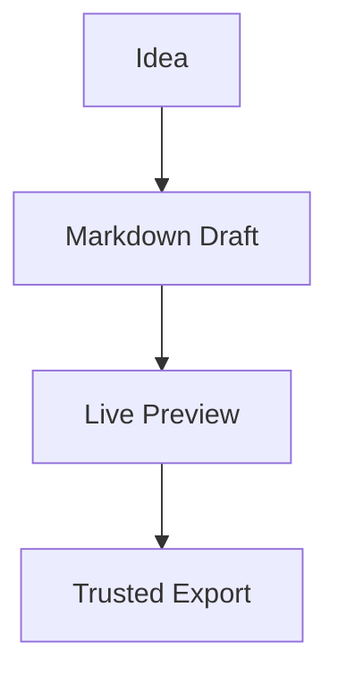
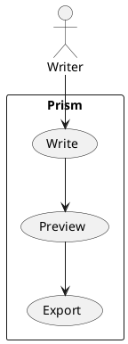

# Diagrams, formulas, and tasks

Prism keeps technical Markdown readable while preserving the source.





```markmap
# Release Plan
## Evidence
### Smoke
### Screenshots
## Package
### macOS
### Windows later
### Linux later
```

The export path should match the screen preview:

$$
confidence = evidence - hidden\\ risk
$$

- [x] Local Markdown opens
- [x] Preview renders diagrams
- [ ] Platform matrix continues after macOS
