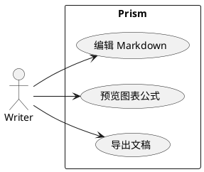

# 复杂内容，也要排得体面

技术文档里常常不只有段落。流程、关系、思维导图、公式和代码都应该进入同一个文稿版面。

## Mermaid


## PlantUML



## Markmap

```markmap
# Prism
## 写作
### 本地文件
### 分屏预览
## 组织
### 链接
### 反链
### 知识图谱
## 交付
### PDF
### HTML
### PNG
### DOCX
```

## KaTeX

当一篇文稿需要公式时，排版也不应该突然变得粗糙：

$$
Quality = \frac{Writing \times Preview}{Friction + Noise}
$$
