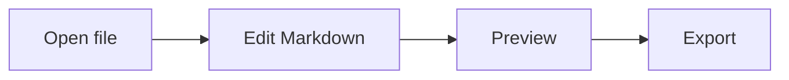
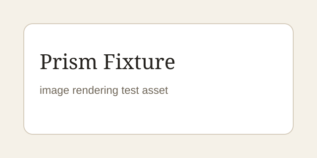

# Prism Full Feature Showcase

This fixture exercises the visible Markdown rendering surface for Prism.

## Paragraphs And Lists

Prism should keep long-form writing readable, with stable line height, predictable paragraph rhythm, and clear distinction between body copy and structural elements.

- First unordered item
- Second unordered item with **bold**, *italic*, `inline code`, and [a local link](04-linked-note.md)
- Third unordered item with a wiki link to [[04-linked-note]]

1. First ordered item
2. Second ordered item
3. Third ordered item

- [ ] Draft the review
- [x] Capture the basic preview surface
- [ ] Verify export feedback

## Code

```ts
type PrismMode = "source" | "split" | "preview";

export function describeMode(mode: PrismMode): string {
  return `Current mode: ${mode}`;
}
```

## Quote

> A focused writing tool should make the current document feel calm, stable, and fast.

> [!NOTE]
> This is a note callout used for visual inspection.

> [!WARNING]
> This is a warning callout used to verify contrast and hierarchy.

## Table

| Feature | Status | Owner |
| --- | ---: | --- |
| Source editing | Ready | Editor |
| Full preview | Ready | Preview |
| Export | Needs verification | Export |

## Math

Inline math should render like $E = mc^2$.

$$
\int_0^1 x^2 dx = \frac{1}{3}
$$

## Mermaid



## Images




## Footnote

This sentence has a footnote.[^one]

[^one]: The footnote checks numbering, spacing, and back-link styling.

