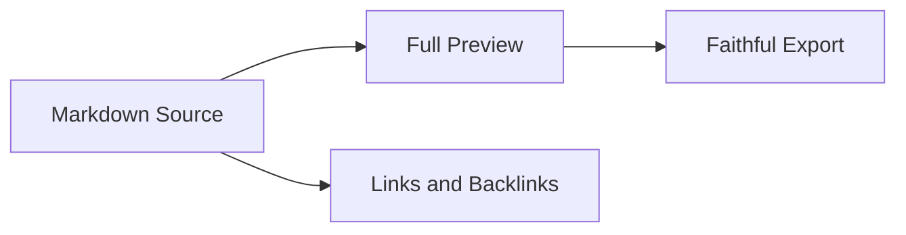

# Prism UI Audit

> [!NOTE]
> This local sample exists only to exercise Prism visual states for a design audit.

Prism is a local-first Markdown writing app. This sample intentionally includes headings, dense prose, tables, code, math, Mermaid, local links, and task lists so the audit can evaluate visual hierarchy, reading rhythm, preview fidelity, and interaction density.

## Writing Flow

The default writing surface should feel calm at ten centimeters from the screen and still structured at one meter. A Markdown writer earns trust when the source pane, preview pane, status bar, command surfaces, and diagnostic surfaces all speak the same visual language.

- Keep the source visible and editable.
- Keep preview typography readable for Chinese and English long-form content.
- Keep utility controls discoverable without making the workspace feel like an IDE.
- Keep export and diagnostics visible only when they help the current document.

## Linked Context

This document links to [Linked Note](Linked%20Note.md). The relation graph button should appear only when the current Markdown document has document link relationships.

## Long Paragraph

Prism should feel like a precise writing instrument rather than a dashboard. The best version has enough density to support repeated professional work, but not so much chrome that the document becomes secondary. The UI can use low-contrast borders and compact controls, but it still needs a few deliberate identity signals: a more distinctive document canvas, clearer title/file state, consistent popover language, and a more confident preview rhythm.

## Table

| Surface | Current Design Question | Desired Outcome |
| --- | --- | --- |
| Title bar | Are primary actions visually balanced? | Clear document identity and view controls |
| Sidebar | Does navigation compete with writing? | Quiet but scannable workspace context |
| Preview | Does typography invite long reading? | Strong body rhythm and code/table clarity |
| Status bar | Are signals contextual? | No clutter when irrelevant |

## Code

```ts
type PrismSurface = "source" | "split" | "preview";

export function describeSurface(surface: PrismSurface) {
  return `Reviewing ${surface}`;
}
```

## Mermaid



## Math

Inline math: $E = mc^2$

Block math:

$$
\\int_0^1 x^2 dx = \\frac{1}{3}
$$

## Tasks

- [ ] Check light mode title bar balance
- [ ] Check split view reading rhythm
- [ ] Check preview-only typography
- [ ] Check relation graph affordance
- [ ] Check command and settings surfaces

