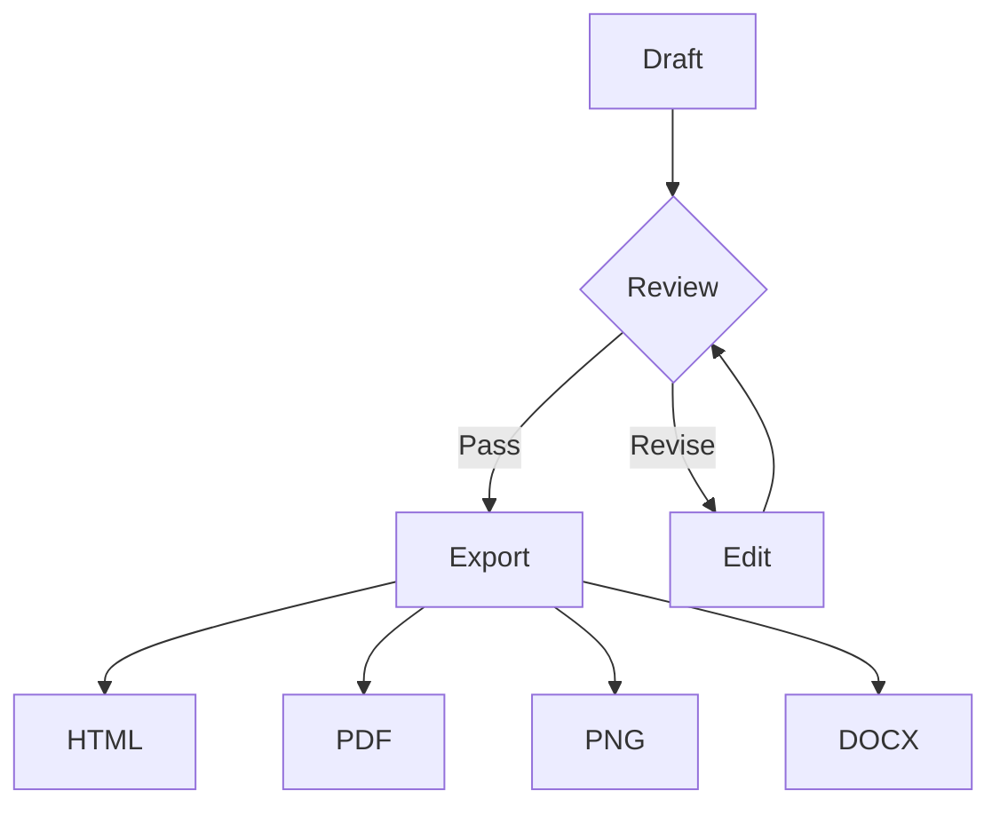
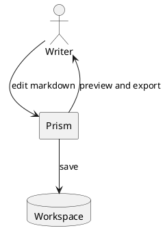

# Real Complex Diagrams Export

This file verifies that Prism preview and export reuse the same rendered diagram output.

## Mermaid Flowchart



## PlantUML Relationship



## Markmap Mind Map

```markmap
# Prism Export
## Preview parity
### Mermaid
### PlantUML
### Markmap
## Output formats
### HTML
### PDF
### PNG 4x
### DOCX
```

## Local Resource


## Table And Math

| Format | Expected |
| --- | --- |
| HTML | self-contained preview output |
| PDF | no missing diagram nodes |
| PNG | keeps selected 4x scale |
| DOCX | readable in office suites |

Inline math: $a^2 + b^2 = c^2$.

Block math:

$$
ExportQuality = \frac{RenderedNodes}{PreviewNodes}
$$
