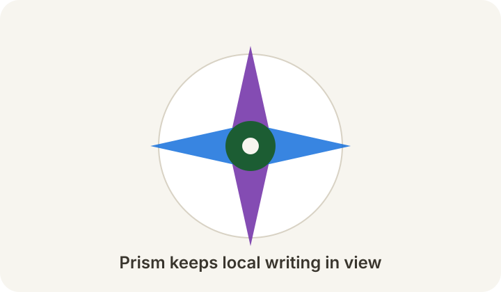
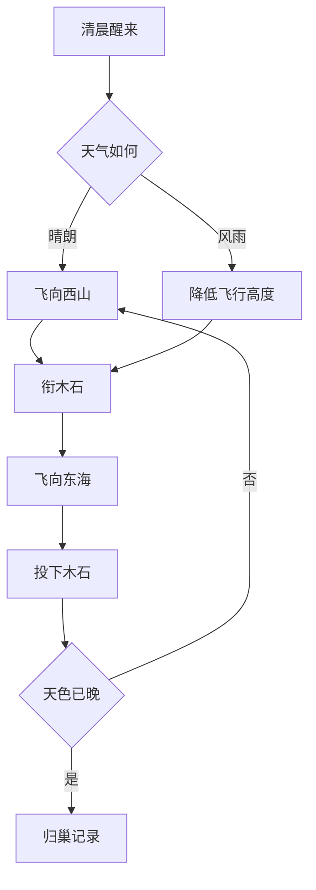
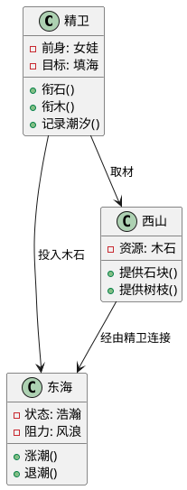

# 📖 Prism Markdown 语法指南

_以《山海经·精卫填海》的执着，展现 Markdown 的结构之美_

---

## 目录

- [标题格式](#标题格式)
- [文本格式](#文本格式)
- [列表](#列表)
- [链接与图片](#链接与图片)
- [表格](#表格)
- [代码](#代码)
- [数学公式](#数学公式)
- [图表 (Mermaid、PlantUML、Markmap)](#图表)
- [引用](#引用)
- [任务列表](#任务列表)
- [脚注](#脚注)
- [分隔线](#分隔线)

---

## 标题格式

# 第一章：少女化鸟，衔石入海

## 炎帝之女游于东海

### 风浪忽起，归途无踪

#### 精卫化形，日日衔木石

##### 沧海虽阔，志不可夺

###### 山河有声，万物记其名

---

## 文本格式

**女娃**游于东海，未能归还，遂化为*精卫鸟*，名留**_山海经_**。

~~沧海不可填~~，但精卫仍一日一日衔来木石。

她的信念并不喧哗，却像海岸线一样清晰。

精卫说："`今日一石，明日一枝，终有回声。`"

水分子为 H~2~O，海潮涨落也离不开它。

这个故事出自上古神话，约在 4^世纪^以前已有流传。

==重点标记==可用于强调一段笔记中的关键判断。

---

## 列表

### 精卫的行动

- **每日任务：**
  - 飞向西山 ⛰️
  - 衔起木石 🪨
  - 投入东海 🌊
    - 记下风向
    - 观察潮汐
  - 回巢休整
  - 次日继续

### 故事发展顺序

1. **东海遇险**
   1. 女娃出游
   2. 风浪骤起
2. **化身精卫**
3. **填海之志**
   - 衔木
   - 衔石
4. **成为象征**

---

## 链接与图片

精卫故事可参见[《山海经》相关资料](https://zh.wikipedia.org/wiki/精卫)。



也可以跳转到文档内章节，如[数学公式](#数学公式)。

---

## 表格

| 角色 | 身份 | 行动 | 象征 |
| --- | --- | --- | --- |
| **女娃** | 炎帝之女 | 游于东海 | 生命的起点 |
| **精卫** | 神鸟 | 衔木石 | 持续行动 |
| **东海** | 沧海 | 接纳风浪 | 巨大难题 |
| **西山** | 山脉 | 提供木石 | 资源来源 |

### 精卫每日记录

| 日期 | 风向 |   木石数量 |   完成度   |
| :--- | :--: | ---------: | :--------: |
| 初一 | 东风 | 12 枚 | ⭐⭐⭐ |
| 初二 | 北风 | 18 枚 | ⭐⭐⭐⭐ |
| 初三 | 微风 | 24 枚 | ⭐⭐⭐⭐⭐ |
| 初四 | 暴雨 |  7 枚 | ⭐⭐ |

---

## 代码

### 精卫行动记录程序

```python
def record_jingwei_day(day, stones, branches):
    """
    记录精卫填海的一天
    """
    total = stones + branches
    if total >= 20:
        status = "充实"
    elif total >= 10:
        status = "稳定"
    else:
        status = "艰难"

    return {
        "day": day,
        "stones": stones,
        "branches": branches,
        "status": status,
    }

records = [
    record_jingwei_day("初一", 8, 4),
    record_jingwei_day("初二", 11, 7),
    record_jingwei_day("初三", 16, 8),
]

for item in records:
    print(f"{item['day']}：{item['status']}")
```

在 Prism 中，行内代码如 `record_jingwei_day()` 会保持等宽字体。

---

## 数学公式

精卫的坚持可以写成一个累积模型：

$$S_n = \sum_{i=1}^{n}(stone_i + branch_i)$$

当每日行动不为零时，时间会改变总量：
$\lim_{n \to \infty} S_n = \infty$

也可以用块级公式表示信念：

$$
Resolve = \frac{daily\_action}{fear + fatigue + delay}
$$

---

## 图表

### 精卫填海流程图



### 精卫与山海关系图



### 精卫填海思维导图

```markmap
# 精卫填海
- 起点
  - 女娃游东海
  - 风浪遇险
- 转化
  - 化为精卫
  - 保留记忆
- 行动
  - 衔木
  - 衔石
  - 每日往返
- 意义
  - 坚持
  - 复原力
  - 长期主义
```

---

## 引用

《山海经》中写道：

> 又北二百里，曰发鸠之山，其上多柘木。
>
> 有鸟焉，其状如乌，文首、白喙、赤足，名曰精卫。
>
> 常衔西山之木石，以堙于东海。

---

## 任务列表

### 精卫行动清单

- [x] 观察潮汐
- [x] 标记西山取材点
  - [x] 木枝区域
  - [x] 石块区域
- [x] 规划飞行路线
- [ ] 建立风暴预案
  - [x] 低空路线
  - [ ] 夜间返航标记
- [ ] 汇总一周记录
- [x] 将今日成果写入 Prism

---

## 脚注

《山海经》[^1]保存了大量上古地理、神话与异物叙事，精卫填海[^2]是其中最具象征意义的故事之一。它常被解释为持续行动[^3]、不向巨大困难退让[^4]、以及用微小积累对抗无边阻力[^5]。

[^1]: 中国古代志怪地理文献，成书年代复杂。
[^2]: 精卫常衔西山木石，以填东海。
[^3]: 每日行动比一次性豪言更重要。
[^4]: 东海象征巨大、长期、难以一次解决的问题。
[^5]: Markdown 文档也适合用小步迭代持续完善。

---

## 分隔线

精卫的故事可以分为三个阶段：

---

**第一阶段：遇海**
女娃游于东海，风浪改变命运。

---

**第二阶段：化鸟**
精卫保留记忆，把悲剧转为行动。

---

**第三阶段：填海**
每日衔木石，不求一日完成，但求从未停止。

---

## 表情符号与特殊字符

精卫的一天：

🌅 清晨出发
🪨 衔起石块
🌊 飞越海面
🧭 记录方向
🌙 夜里归巢
✨ 明日继续

### 常用符号

- 书名号：《山海经》《精卫填海》
- 箭头：西山 → 东海 → 归巢
- 省略号：海面仍旧辽阔……
- 破折号：精卫说 - 今日也要继续
- 版权符号：© Prism 示例文档

---

_"日日行，不怕远。"_ - Prism 示例

**Markdown 语法演示完毕**

> 本文档以《山海经·精卫填海》为线索，展示 Prism 对 Markdown 写作、完整预览、公式、图表、任务清单与本地图片的支持。你可以直接复制其中任意片段，作为自己的文档模板。
